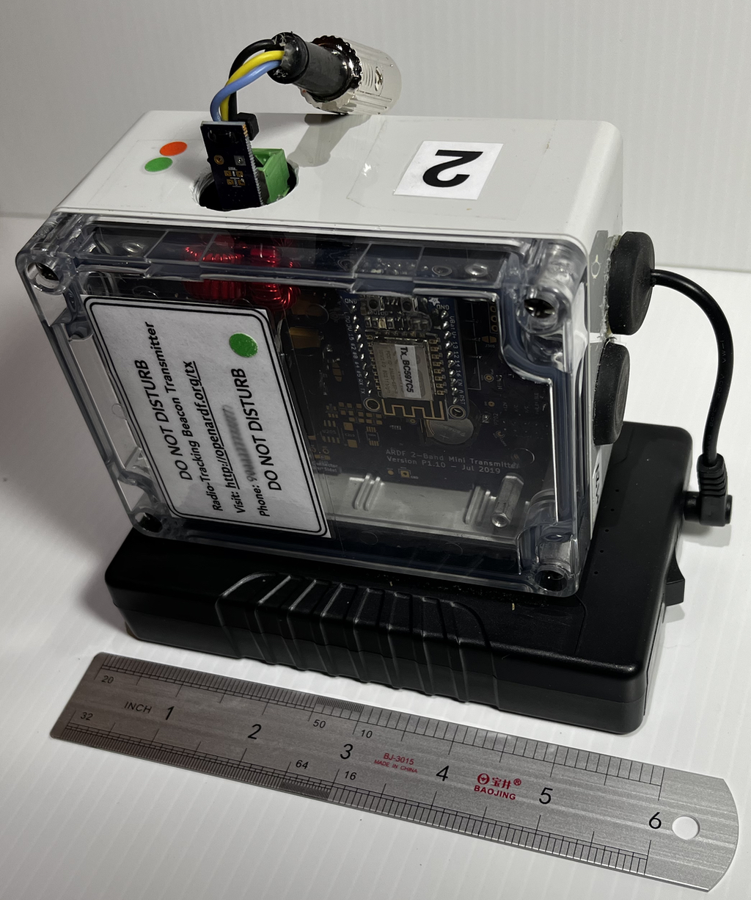

# FlexFox80
A very configurable remote-controllable 80m ARDF transmitter. It has no external buttons or switches, and contains its own webserver and is configured using most WiFi-capable devices, such as smartphones, tablets, or laptops.

Flexfox can be configured to function as an 80m "fox" transmitter for any type of Amateur Radio Direction Finding event, such as classic, sprint, or even foxoring.  

<b>KiCad</b>

The KiCad folder holds files for generating the schematic, BOM, and PCB files using KiCad. 

<b>Software</b>

The Software folder holds files for compiling executable code using Atmel Studio 7. 
